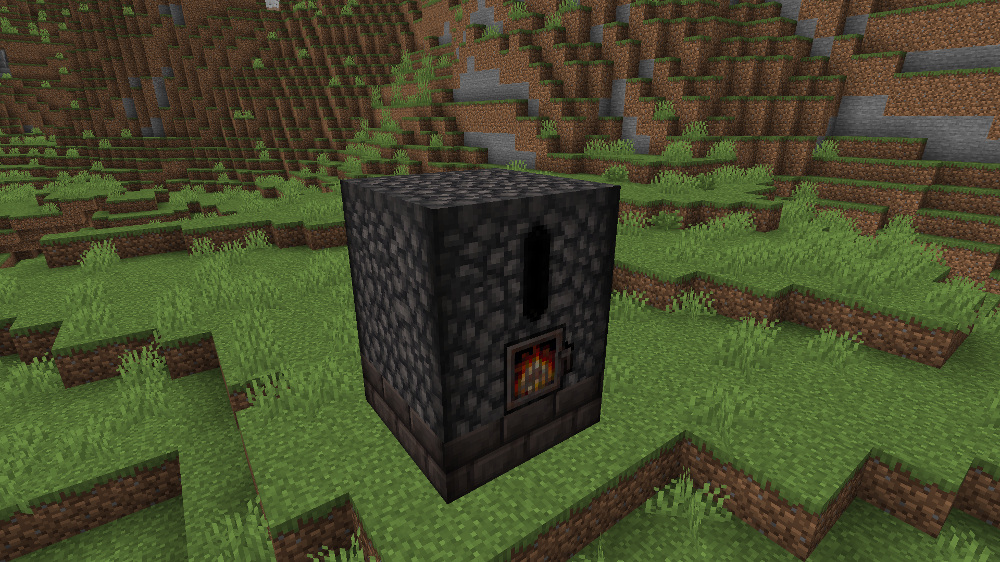

<div align="center">



# HaoHan Metallurgy

A custom metallurgy plugin for HaoHan SMP, built around the Ancient Forge system.

[](https://www.minecraft.net/)
[](https://papermc.io/)
[](https://purpurmc.org/)
[](https://openjdk.org/)
[](https://maven.apache.org/)
[](https://github.com/google/gson)
[](https://junit.org/junit5/)

Language: [Tiếng Việt](README.md) | English

</div>

## Overview

HaoHan Metallurgy is a Minecraft plugin for HaoHan SMP. It provides a custom metallurgy system that handles machine logic, forge recipes, GUI interactions, custom items, and persistent machine data on the server.

## Tech Stack

| Toolkit | Role |
| --- | --- |
| Paper API | Main server API used for plugin development. |
| Purpur | Recommended server runtime for deployment. |
| Java 21 | Main programming language and runtime. |
| Maven | Dependency management and `.jar` build pipeline. |
| Gson | JSON handling for recipe and configuration data. |
| JUnit 5 | Unit testing framework. |

## Project Components

| Component | Description |
| --- | --- |
| `HaoHanMetallurgy` | Server plugin that handles logic, GUI, recipes, and machine data. |
| `HaoHanMetallurgy_Datapack` | Datapack that disables selected vanilla recipes and adds related advancements, loot tables, and tags. |
| `HaoHanMetallurgy_Resourcepack` | Resource pack that provides textures and models for custom items or blocks. |

## Requirements

- Minecraft server running Paper or Purpur.
- Java 21 or newer.
- Maven 3.9 or newer if building from source.
- The companion datapack and resource pack for the full feature set.

## Installation

1. Build or download the plugin `.jar` file.
2. Copy the `.jar` file into the server `plugins/` directory.
3. Copy the datapack folder or `.zip` file into `world/datapacks/`.
4. Install the resource pack on the client, or configure the server to prompt players to download it when joining.
5. Restart the server.
6. Run `/reload` if you need to reload the datapack during development.

On first startup, the plugin creates its configuration file at `plugins/HaoHanMetallurgy/config.yml`.

## Build From Source

Run this command in the plugin project root:

```bash
mvn clean package
```

The built `.jar` file will be generated in the `target/` directory.

For a faster build without tests:

```bash
mvn clean package -DskipTests
```

## Development Script

The project includes `build_and_start.ps1` to help build the plugin and start a local development server.

Before using it, review and update the paths in the script for your machine, especially the project path, the server `plugins/` directory, and the server directory.

```powershell
.\build_and_start.ps1
```

## Commands

Administrative commands require the `haohansmp.metallurgy.admin` permission. Server operators receive this permission by default.

| Command | Description |
| --- | --- |
| `/metallurgy info` | Shows plugin information. |
| `/metallurgy reload` | Reloads configuration and recipes. |
| `/metallurgy debug` | Toggles debug mode. |
| `/metallurgy list` | Lists managed metallurgy machines. |
| `/metallurgy give <player> <item_id> [amount]` | Gives a custom item to a player. |

Main command aliases: `/met`, `/forge`.

## Permissions

| Permission | Default | Description |
| --- | --- | --- |
| `haohansmp.metallurgy.admin` | OP | Allows access to administrative commands. |
| `haohansmp.metallurgy.use` | All players | Allows interaction with metallurgy machines. |

## Recipe Structure

Metallurgy recipes are stored in `src/main/resources/recipes/`. Each recipe defines its ingredients, output, and Ancient Forge processing parameters.

Reference example:

```text
src/main/resources/recipes/example_forge.json
```

## Operational Notes

- Install the plugin, datapack, and resource pack together to avoid missing recipes, textures, or progression data.
- Avoid editing runtime server data directly when the change can be managed from source.
- After updating datapack or recipe files on a running server, verify the changes with `/reload` and `/metallurgy reload`.
